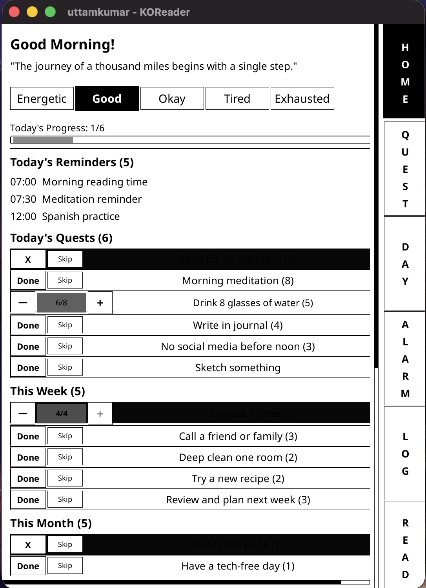
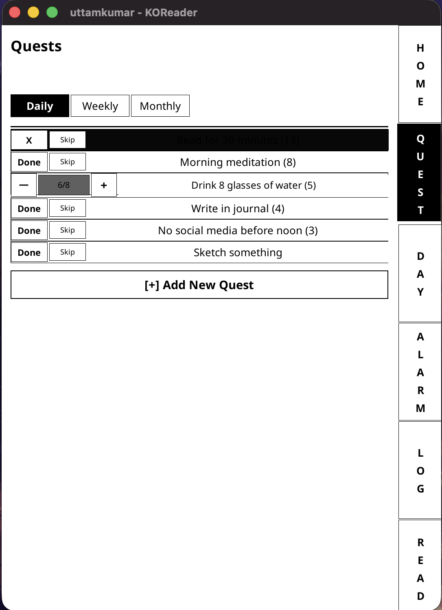
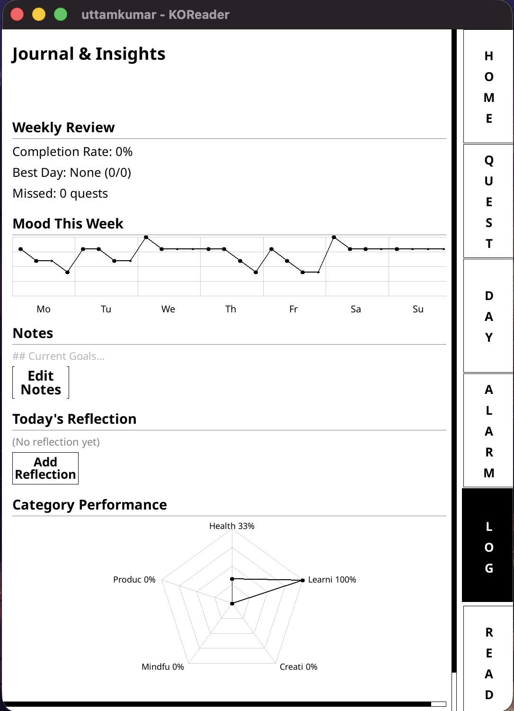
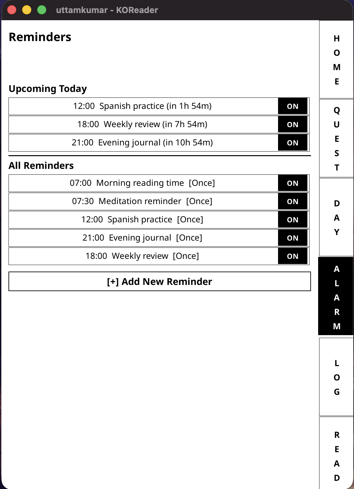
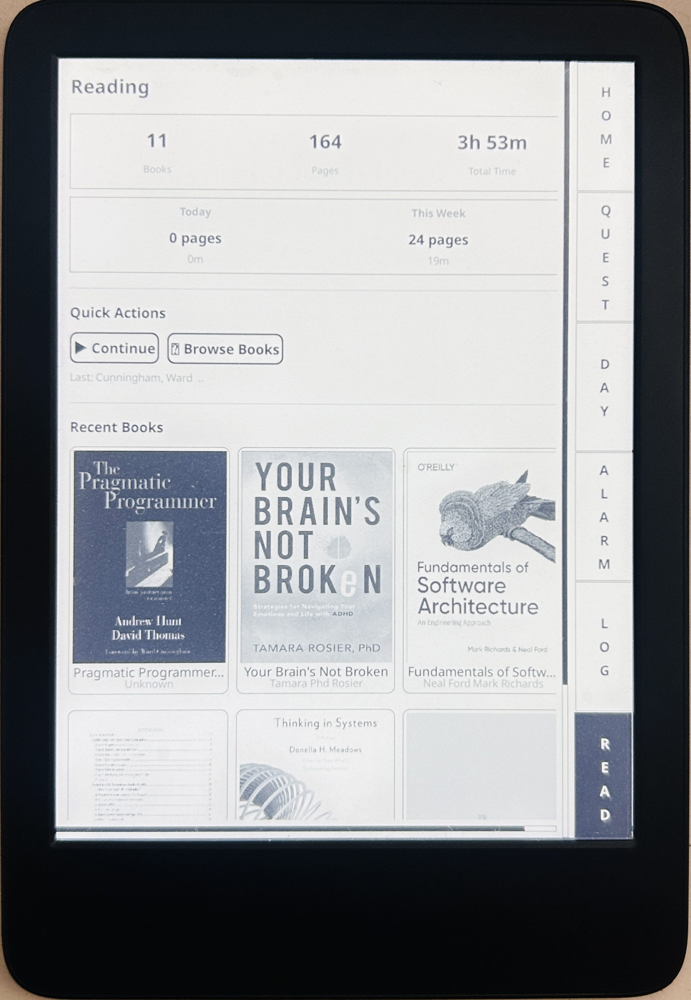
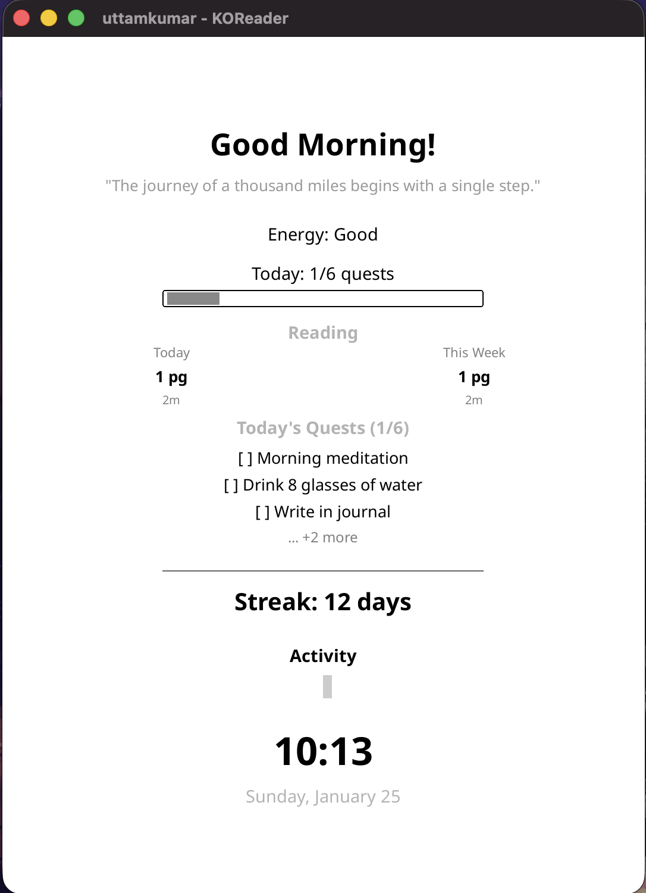

# Life Tracker for KOReader

A bullet journal-style life planner plugin for KOReader. Track quests, habits, mood, and reading stats directly on your e-reader.


## Screenshots

<p align="center">
  
  
  
</p>

<p align="center">
  
  
  
</p>

## Features

- **Dashboard** - Morning energy check-in, daily quote, streak tracking, today's quests at a glance
- **Quests** - Daily, weekly, and monthly goals with streaks and progress tracking
- **Reminders** - Time-based notifications with customizable schedules
- **Journal** - Weekly mood graph, category performance spider chart, notes and reflections
- **Reading Stats** - Integration with KOReader's reading history and statistics
- **Sleep Screen** - Optional dashboard display when device wakes showing time, quests, and reading progress

## Installation

### Method 1: Download Release

1. Download the latest release from [Releases](https://github.com/uttam-salamander/koreader-life-tracker/releases)
2. Extract `lifetracker.koplugin` folder
3. Copy to your KOReader plugins directory (see paths below)
4. Restart KOReader

### Method 2: Clone Repository

```bash
# Clone directly to your plugins folder
cd /path/to/koreader/plugins/
git clone https://github.com/uttam-salamander/koreader-life-tracker.git lifetracker.koplugin
```

### Plugin Paths by Device

| Device | Path |
|--------|------|
| **Kindle** | `koreader/plugins/lifetracker.koplugin/` |
| **Kobo** | `.adds/koreader/plugins/lifetracker.koplugin/` |
| **PocketBook** | `applications/koreader/plugins/lifetracker.koplugin/` |
| **Android** | Varies by installation (check your KOReader folder) |
| **Desktop/Emulator** | `koreader/plugins/lifetracker.koplugin/` |

### Verify Installation

After restarting KOReader:
1. Open the top menu (tap top of screen or swipe down)
2. Navigate to **Tools** (gear icon)
3. Look for **Life Tracker** in the menu

## Usage

### Getting Started

1. Open **Tools > Life Tracker**
2. Start with the **Dashboard** - do your morning energy check-in
3. Create your first quest in the **Quests** tab
4. Track your progress throughout the day

### Dashboard

The home screen shows:
- **Daily Quote** - Rotating motivational quotes (customizable)
- **Energy Level** - Tap to set your current energy state
- **Today's Reminders** - Upcoming scheduled reminders
- **Today's Quests** - Quick view of daily, weekly, and monthly tasks

### Quests

Organize your goals into three categories:
- **Daily** - Reset each day (habits, routines)
- **Weekly** - Reset each week (bigger tasks)
- **Monthly** - Reset each month (major goals)

Quest features:
- **Streaks** - Track consecutive days of completion
- **Progress Tracking** - For countable goals (e.g., "Drink 8 glasses of water")
- **Categories** - Organize by Health, Learning, Creativity, Mindfulness, Productivity
- **Skip Option** - Mark a quest as skipped without breaking your streak

### Reminders

Set gentle notifications:
- Choose time (24-hour format)
- Select repeat days (Daily, Weekdays, Weekends, or custom)
- View upcoming reminders for today
- Toggle reminders on/off

### Journal & Insights

Review your patterns:
- **Weekly Stats** - Completion rate, best days
- **Mood Graph** - Energy levels throughout the week
- **Category Performance** - Spider chart showing balance across categories
- **Notes** - Persistent notes for goals and ideas
- **Reflections** - Add daily reflections

### Reading Stats

Track your reading:
- Total books, pages, and reading time
- Today and this week statistics
- Recent books with cover images
- Quick actions to continue reading or browse books

### Sleep Screen

Enable the sleep screen to see your dashboard when your device wakes:
- Current time and date
- Daily quote and energy level
- Quest progress with checklist
- Reading stats (today and this week)
- Current streak and activity indicator

Enable via **Settings > Sleep Screen Dashboard**.

### Settings

Customize the plugin:
- **Energy Categories** - Rename levels to match your vocabulary
- **Time Slots** - Adjust to your schedule (Morning, Afternoon, Evening, Night)
- **Quest Categories** - Add or modify category names
- **Quotes** - Customize your daily quote rotation
- **UI Scale** - Adjust text size for accessibility (0.8x to 1.5x)
- **High Contrast** - Enhanced visibility mode
- **Sleep Screen** - Show dashboard when device wakes
- **Backup/Restore** - Export and import your data as JSON

## Navigation

### Sidebar Tabs

| Tab | Function |
|-----|----------|
| **HOME** | Dashboard with overview |
| **QUEST** | Manage daily/weekly/monthly quests |
| **DAY** | Timeline/calendar view |
| **ALARM** | Reminders management |
| **LOG** | Journal and insights |
| **READ** | Reading statistics |


## Data Storage

Your data is stored in KOReader's settings directory:

| File | Contents |
|------|----------|
| `lifetracker_settings.lua` | User preferences, quotes, streak data |
| `lifetracker_quests.lua` | Quests and completion history |
| `lifetracker_logs.lua` | Mood entries and journal notes |
| `lifetracker_reminders.lua` | Reminder schedules |

Use **Settings > Backup & Restore** to export/import your data as JSON.

## Troubleshooting

### Enable Debug Logging

To enable detailed logging for troubleshooting:

1. Open `modules/data.lua` in the plugin folder
2. Find line 18: `Data.DEBUG = false`
3. Change to: `Data.DEBUG = true`
4. Restart KOReader

Logs will appear in:
- **Device**: `koreader/crash.log`
- **Emulator**: Console output or `crash.log`

To view logs on device via SSH:
```bash
tail -f /mnt/us/koreader/crash.log  # Kindle
tail -f /mnt/onboard/.adds/koreader/crash.log  # Kobo
```

### Common Issues

**Plugin not appearing in menu:**
- Ensure folder is named `lifetracker.koplugin` (not `.koplugin.zip`)
- Check that `_meta.lua` and `main.lua` exist in the folder
- Restart KOReader completely

**Data not saving:**
- Check available storage space on device
- Verify write permissions to settings directory

**Sleep screen not showing:**
- Enable in Settings > Sleep Screen Dashboard
- Some devices may not support custom sleep screens

## Designed for E-Ink

- High contrast black & white UI
- Large tap targets for touch accuracy
- Minimal screen refreshes
- Optimized for grayscale displays
- Responsive layout for different screen sizes

## Requirements

- KOReader 2024.01 or newer
- Any device running KOReader (Kindle, Kobo, PocketBook, Android, etc.)

## Contributing

Issues and pull requests welcome!

## License

AGPL-3.0 (same as KOReader)
